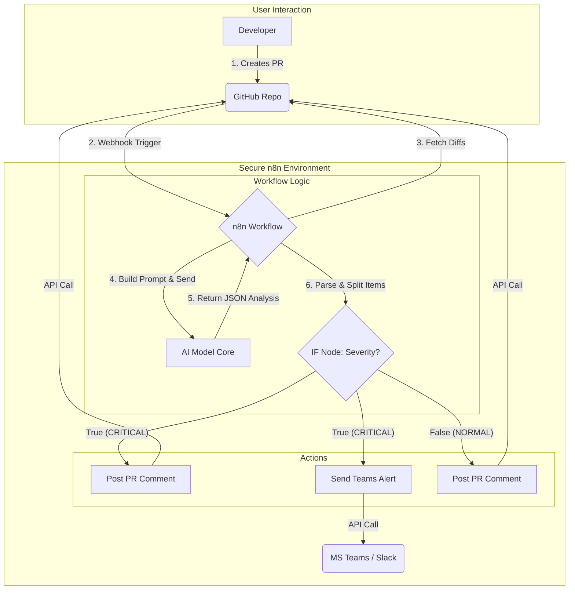

# AI Code Review Agent - TCS AI Hackathon Demo


This repository serves as a live demonstration for an **AI-powered Agentic Workflow** that automates code reviews for GitHub Pull Requests.

## 1. The Problem: The Code Review Bottleneck

In modern software development, manual code reviews are essential for maintaining quality and security. However, they are also:
*   **Time-Consuming:** Senior developers spend significant time on reviews, pulling them away from feature development.
*   **Inconsistent:** The quality of a review can vary greatly depending on the reviewer's availability, expertise, and attention to detail.
*   **Slow:** The feedback loop for developers can be long, delaying the entire development lifecycle.

## 2. Our Solution: An Intelligent AI Review Agent

This project introduces an automated AI agent, built on the **n8n workflow platform**, that acts as a tireless, expert code reviewer.

When a developer creates a Pull Request in this repository, the following automated workflow is triggered:

1.  **PR Analysis:** The agent fetches the code changes (`diffs`) from the PR.
2.  **AI-Powered Review:** It sends the code to a Large Language Model (LLM) with a specific prompt, instructing it to analyze the code for bugs, vulnerabilities, and style issues.
3.  **Severity Classification:** The AI classifies each identified issue as `CRITICAL` or `NORMAL`.
4.  **Intelligent Actions:**
    *   For **`NORMAL`** issues, the agent posts a standard review comment directly on the PR.
    *   For **`CRITICAL`** issues, it posts a comment **and** sends a high-priority alert to a designated MS Teams/Slack channel.

This creates an instant, consistent, and intelligent feedback loop, enhancing both developer productivity and code quality.

## 3. Live Demo Walkthrough

This repository is fully connected to our live n8n workflow. You can see the agent in action by following these steps.

### Step 1: Make a Code Change

Clone this repository and create a new branch. Open the `test.py` file and introduce an error. For example, create a division-by-zero error:

```python
# filepath: FastAPI/test.py
# ... existing code ...

def divide_nums(a, b):
    # Change the denominator to zero to create a critical error
    return a/0

# ... existing code ...
```

### Step 2: Create a Pull Request

Commit your change, push the branch to GitHub, and create a new Pull Request.

*(Screenshot of the new Pull Request being created)*

### Step 3: Observe the AI Agent in Action

Within a minute, you will see the AI agent perform the following actions:

1.  **Add a Label:** A label like `review-in-progress` will be added to your PR.
2.  **Post Comments:** The agent will post comments directly on the lines of code where it found issues. It will identify the `ZeroDivisionError` as a `CRITICAL` issue.

*(Screenshot of the GitHub PR showing the AI's comments on the code)*

3.  **Send a Critical Alert:** Because a `CRITICAL` issue was found, a notification will be sent to our configured Teams/Slack channel.

*(Screenshot of the notification message in Teams or Slack)*

## 4. Technical Architecture

The entire process is orchestrated by a self-hosted n8n instance, ensuring the workflow is secure, private, and highly customizable.



### Key Technologies Used
*   **Orchestration:** [n8n.io](https://n8n.io/)
*   **Version Control:** GitHub
*   **AI Model:** OpenAI GPT-4 / Llama 3 (via Ollama)
*   **Notifications:** MS Teams / Slack

---
*This project was developed for the TCS AI Hackathon 2025.*
